# Assignment 3 - Agent-based Simulation
> * Participant name: Maxwell Stolarenko

This repository is a reupload of a project I worked on as a Modeling and Simulation graduate student at the University of Central Florida to allow for public access. All work shown here was written by me.

## General Introduction

Agent-based modeling (ABM) is a style of computational modeling that focuses on modeling individuals, components of individuals, or heterogeneous parts of a complex system.  ABM as a style of computational modeling, requires both mathematical and experimental approaches for its development and application.

(We have broken each section up to a series of subtasks to help break up the problem.)

## Part 1 - (Python) Cellular Automata ABM Fire Simulation (50%)

This project simulates the spread of a fire through a forest. The wildland fire spread is a combustion reaction where the necessary ingredients for its occurrence are: the vegetation, which provides the combustible source for the reaction; the oxygen in the air, which actuates as an oxidizing agent; and a heat source responsible for the initiation and the self-sustainability of the reaction. The fire spreads across the landscape consuming the vegetation and this process can be decomposed into two combustion phases: combustion (red) and extinction (black). There also will be an initial state showing where the fuel source vegetation (green). We will use a  Cellular Automata ABM to simulate this system. CA are models that assume space, state, and time are discrete. A square lattice represents the space and each element that constitutes the lattice is called a cell. Each cell has a neighborhood, a set of internal state variables, and a local rule that describes the transition between the state variables and defines the future state as a function of the cell's present state and the neighborhood's present states. This is an example of a common feature of complex systems, the presence of a non-linear threshold or critical parameter. We also live in Central Florida, this is usually the "fire season" here since Winter has some of the driest months of the year (and the tail end of our "dry" season).

We will be using Python for this part. For the first part of this assignment, we will also be using [**Mesa**](http://mesa.readthedocs.io/en/latest/tutorials/intro_tutorial.html). [**Mesa**](http://mesa.readthedocs.io/en/latest/tutorials/intro_tutorial.html) is a Python framework for agent-based modeling.

You should clone [**Mesa Git Repository**](https://github.com/projectmesa/mesa) and look at the example directory and try to get a few to run to see how things work. Mesa also has a good [**documentation doc**](https://media.readthedocs.org/pdf/mesa/latest/mesa.pdf) that you should look over.

*There are 8 subparts to help structure and scaffold your simulation. Each part building on the last.*

1. Change how the initial  forest agents spread the "burns" test and report the difference between a Von Neumann neighborhood and a Moore neighborhood for the same initial  conditions.  
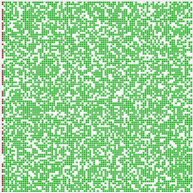 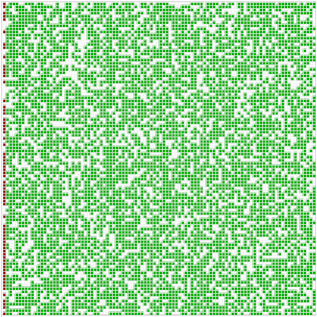 
**Left gif:** A visualization of a forest fire in a Von Neuomann neighborhood. 
**Right gif:** A visualization of a forest fire in a Moore neighborhood. 
**Report:** When under the same initial conditions such as tree density, tree locations, burn rate and initial burn locations, it took significantly longer for the fire to spread from the left side of the map all the way to the right in the Von Neuomann neighborhood compared to the Moore neighborhood. Specifically, the Von Neumann neighborhood took almost twice as many steps from start to finish than the Moore neighborhood (~30 steps vs ~75 steps). Additionally when at lower tree densities like 65%, the Von Neumann simulation left several patches of tree untouched whereas the Moore neighborhood was completely burned each time.  
2. Fix a Von Neumann neighborhood. Change the spread from 1,2,4 and report and graph the changes on the changes.  
**Fire Spread Rate = 1** 
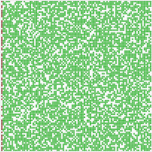 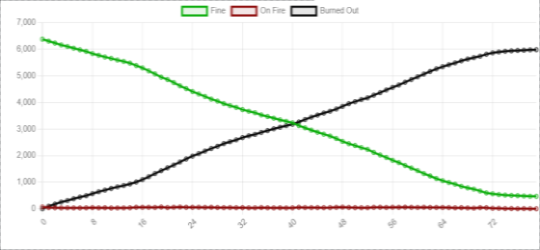 
Report: A Von Neumann neighborhood with a spread rate of 1 takes approximately 70 or more steps to complete its full burn path  
**Fire Spread Rate = 2** 
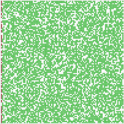 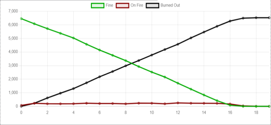 
Report: A Von Neuomann neighborhood with a spread rate of 2 takes approximately 20 steps to complete its full burn path.  
**Fire Spread Rate = 4** 
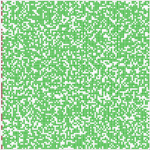 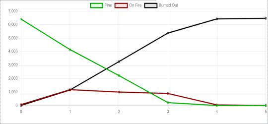 
Report: A Von Neumann neighborhood with a spread rate of 4 takes approximately 6 steps to complete its full burn path   

3. Add the ability to plant trees where you want them based on an underlying **distribution map**. (So not only are trees randomly scattered based on density, there is an underlying image file of the same grid size which specifies the probability trees are located there. White = trees, black=no trees). Test and load 3 different maps that you create. Currently, the map is created randomly. You will have to add functionality to load an image and set the areas (1 or 0) that get trees. 
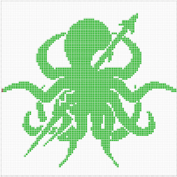 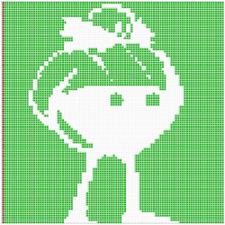 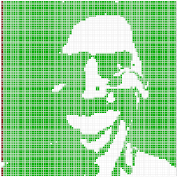  

4. Currently, the model is set to if x==0 things are on fire. Add 1 to 3 burn starting burn points in the middle. 
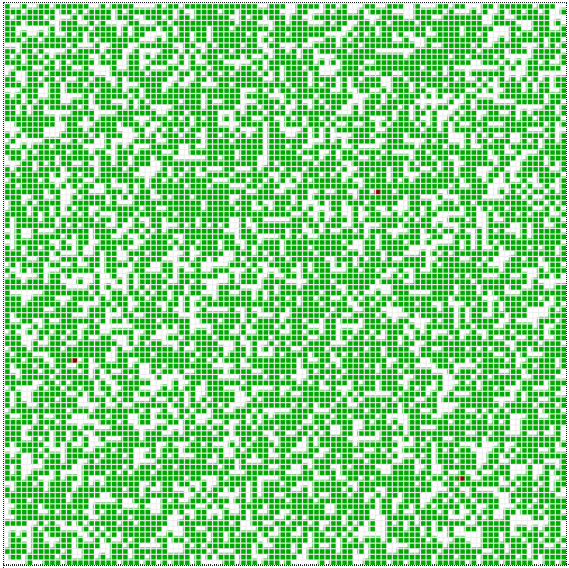 
The following gif is a visualization of a forest fire map with 3 initial burn points scattered across the whole map, rather than the fire initializing at x = 0. This visualization shows that it took 24 steps to competely burn the map, which is much faster than setting the burn points at one of the ends of the map. Multiple runs with the same initial conditions suggest multiple burning points take approximately 24-29 steps to completely burn the map.  

5. Create a distribution map from satellite data (i.e. Landsat as one example but anything you *google* is likely ok) - something that has water and forest - so you read in the image, determine if the pixel is (roughly) green or (roughly) blue - (*this does not have to be perfect, just plausible*) - sets the distribution map and runs the simulation. Load **3 different images** you googled. Add different densities based on green intensity. Report on the simulation. 
**Landsat Location 1: St. Louis, Missouri** 
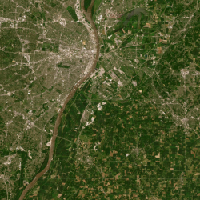 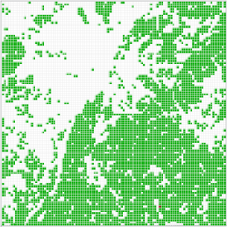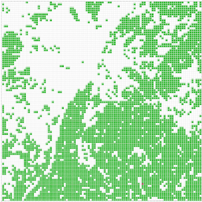 
Report: The following animated visualization demonstrates the anticipated burn path for a sudden forest fire east of St. Louis, Missouri. St. Louis has a heavy concentration of urban settlement west to a major road and a significant amount of trees east of that road, prompting dangers if a fire were to ever break out east of the city. The gif shows how quickly the entire forest would be engulfed in the fire and how even part of St. Louis itself would be caught in the fire.  
**Landsat Location 2: Chicago, Illinois** 
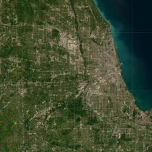 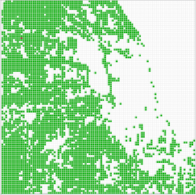 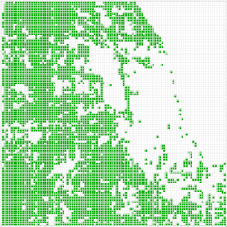 
Report: The following animated visualization demonstrates the anticiapted burn path for a brushfire abrupted appearing right outside of Chicago, Illinois. Chicaco has a rather dense forest west of its city and a large amount of its city without muany trees. Parts of the city near the coast of the nearby lake would be untouched by the fire but northern and sourther Chicaco would get hit.  
**Landsat Location 3: Seattle, Washington** 
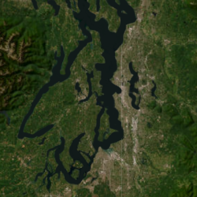 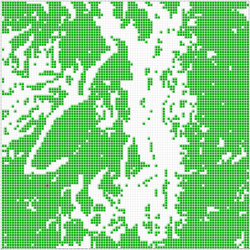  
Report: The following animated visualization demonstrates the anitcipated burn path for a sudden forest fire in Seattle, Washington and its surrounding environment. Seattle is thankfully surrounded by several bodies of lakes and rivers that slow the rate of burning through the forest but almost all of Seattle is caught in the fire by the end of the simulation.   

6. Modify your maps to have a "burn line" - an area that you have modified from the map above that stops the spread of the fire by painting on the distribution map. Show the result of with and without it. (Graph the result) 
**Map Set 1: St. Louis, Missouri** 
   
**Left Image:** Tree density map of St. Louis, Missouri with a set burn point. 
**Middle Image:** Animated visualization of the burn sequence for St. Louis, Missouri. 
**Right Image:** Animated visualization of the burn sequence for St. Louis, Missouri, with an added burn line to prevent excessive fire spread.   
**Map Set 2: Chicago, Illinois** 
  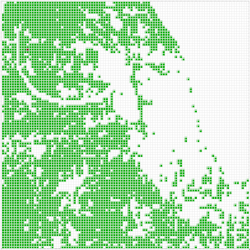 
**Left Image:** Tree density map of Chicago, Illinois with a set burn point. 
**Middle Image:** Animated visualization of the burn sequence for Chicago, Illinois. 
**Right Image:** Animated visualization of the burn sequence for Chicago, Illinois, with an added burn line to prevent excessive fire spread.   
**Map Set 3: Seattle, Washington** 
  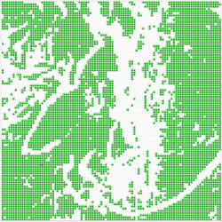 
**Left Image:** Tree density map of the Seattle, Washington region with a set burn point. 
**Middle Image:** Animated visualization of the burn sequence for the Seattle, Washington region. 
**Right Image:** Animated visualization of the burn sequence for the Seattle, Washington region, with an added burn line to prevent excessive fire spread.   
**Provide 8-10 sentences on the following questions:**
7. How would you validate this model and use to predict forest fires and predict how to combat them?  
The forest fire model tells us the general pathing a fire will travel in the event a tree begins burning. We can anticipate how a fire will move and behave based on the density of vegetation we observed through satallite data. While we cannot predict where the fire will originate from until it begins to spread, we can devise a strategy for cutting the fire off before it spreads across the entire region. Some of the example regions I visualized had specific areas on their map with bottleneck spots where the fire had to cross a very small area in order to access a larger area. Combat predictions could make efforts to actively block off these bottleneck areas to limit the overall spread of a forest fire with at least half of the region left untouched by the fire. Other ways to validate this model to predict forest fire prevalence and behaviors was when we modified the spread rate across different scenarios. The rate of spread could be attributed to additional factors that may increase or decrease the rate at which a forest fire travel, such as how winds can greatly increase the rate at which brushfires spread. The model shows how quickly the fire can get out of hand at accelerated rates and may prompt services in those regions to take certain precautionary measures to prevent those fast rate fires.

8. How realistic is this simple model and what (if anything) would you want to add to increase the validity of the simulation?  
A major criticism I have for this simple forest fire model is that it can appear too simple when attempting to look at more refined contexts. This forest fire model is a neat tool to see how quickly a fire can spread throughout an entire region based on tree densities, but the current forest fire model leaves much to be desired if one is using it to determine realism and feasibility. The simulation functions under a controlled environment where every tree behaves the exact same way. They all burn at the same rate and have the same likelihood to burn based on the amount of trees near it. For the model to have more significant realism, it should not dictate a rate of burning or spreading fire on tree placement alone. Another major criticism for the model's realism is how it determines what a tree is based on its physical appearance over satallite data imagery. If the satallite has green regions, then the model considers that region take have a tightly packed density of trees, but in doins so would fail to record areas with dead trees or shrubbery. Perhaps another way the model could more accurately define regions without trees would be to determine which areas typically do not have trees (i.e. asphalt or concrete structures) and drawing trees for anywhere that does not contain such entities.

## Part 2 - (Anylogic) - Port and Container Ship Dynamics ABM Simulation (50%)
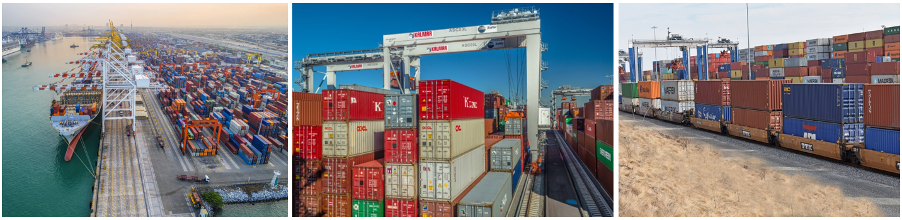

Agent-based models are often used to simulate and analyze various transportation problems, such as seaport container terminals. Seaport container terminals facilitate the movement of cargo between the sea and land necessary for our economy. Therefore, it is important that these terminals operate optimally to reduce costs and increase cargo flow. For this assignment, we assume this seaport terminals system operate in four subsystems: (1) routing, scheduling, and queuing ships to available berths; (2) waterside ship berth container unloading; (3) landside container yard storage; and (4) landside container shipping through trucks and trains. We will be creating each part of this system in an AnyLogic model to understand general port operations using ABMs.

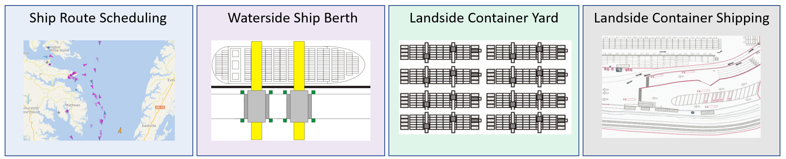

First pick a port of your choosing and research metrics about how many ships berths, container yard area, truck and train layout. For the homework this does not have to exactly mimic every single aspect and feature of your choosen port - however you should integreate rough estimates for loading and unloading times, etc the best you can. 
**Preface:** The models developed for this assignment reference part of a preexisting model. Specifically, some of the parameter and model rules for the crane's behaviors and relevant parameters for containers and land transportation vehicles drew reference to [AnyLogic's Cloud Database](https://cloud.anylogic.com/model/43daaa76-ed99-4544-8d50-9867b7525a81?mode=SETTINGS&tab=GENERAL) example of a crane simulation.

1. Create an agent based simulation in AnyLogic 1.  Pick a port of your choosing and research rough metrics about how many ships berths, container yard area, truck and train layouts. For the homework this does not have to exactly mimic every single aspect, feature, or measurement of your chosen port – however, the research should serve as guidance to understand how to pick a plausible starting number of cranes, loading and unloading times, container area size, and truck-train transport loading.  Provide details about your port in text and images. 
I chose to base this part of my assignment around the Dames Point Terminal in Jacksonville, Florida. Jacksonville is home to several maritime ports, umbrellaed under one entity: Jacksonville Port Authority, or Jaxport for short. The three ports in the Jaxport circle are the Blount Island Marine Terminal which mainly handles shipping vessels carrying heavy machinery or vehicles, the Dames Point Martine Terminal which is responsible for most container ships arriving from South America and Asia, and the main Jaxport Authority Terminal overseeing all other cargo types [(Jaxport)](https://www.jaxport.com/). For this assignment, I focused my attention towards the Dames Point Terminal specifically, as I admired its simplistic land-based storage layout as well as its close accessibility to land-based transportation of goods via railroads. 
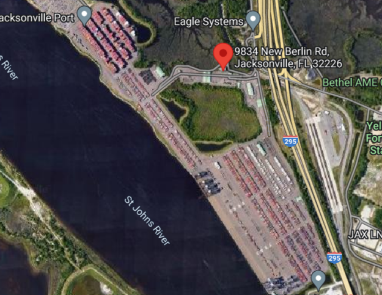 
Included are several metrics and quantitative data of the port itself:  
Regarding ship handling, Jaxport's Dames Point Terminal port has 3 berths, 6 deep water cranes for transporting containers off and on to cargo ships, and 6 land cranes for transporting containers from land transportation to land-storage. By using a live map tracker for the port, I was able to deduct that ships berthed in Dames Point Terminal typically take 16-20 hours to complete a full cargo unloading cycle. The layout of the river around the port forms a full loop, allowing ships to enter the port area without interferring with any ships attempting to exit, which may also contribute to the quicker cargo unloading process.  
Regarding land-storage, the Dames port has three main land storage areas with different dimensions and capacities for containers. The northernmost container yard area houses five rows of containers that typically stack two units high. Total container count can estimate in the 3000s for that area of the container yard alone. The center-most container yard area has the least amount of active containers and is typically reserved for temporarily storing containers until a land tranport vehicle can move it elsewhere, either in the upper land storage for sending back out to sea or to the southern yard area for land transportation further into the country. Finally, the southern container yard area houses containers ready for pickup by land vehicles to move elsewhere. The southern section houses approximately 12 sectors each having up to approximately 200 containers, totallying at over 2200 containers for this area alone.  
The port also has an intricate rail-system for transporting goods out of the port and into other neighboring ports or further into the country. The rail system is housed right outside of the port's land storage area and is likely not used to transport goods to another side of the Dames port. 
 

2. Create an agent-based simulation in AnyLogic that focuses on containers moving from the sea to the land. You will implement the four sub-systems as one simulation in an AnyLogic model using the data and parameters from Part 1 - (1) routing, scheduling, and queuing ships to available berths; (2) waterside ship berth container unloading; (3) landside container yard storage that includes 4 major storage areas (domestic, international, long-term, and hazardous); and (4) landside container shipping through trucks and trains that moves containers out of the yard. You can utilize a [**crane model**](https://cloud.anylogic.com/model/43daaa76-ed99-4544-8d50-9867b7525a81?mode=SETTINGS) from AnyLogic cloud, however you must cite the parts you utilize. 
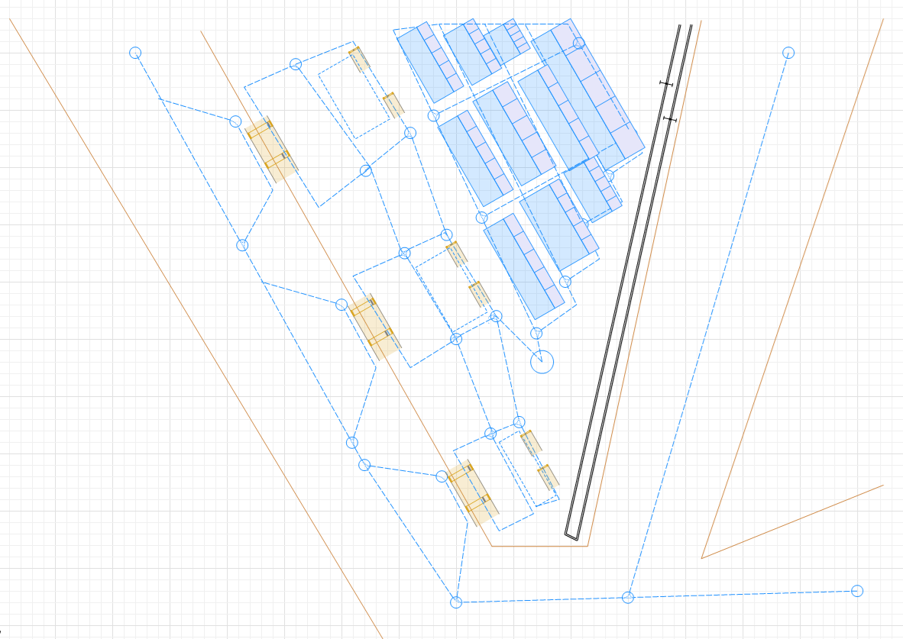 
The following model demonstrates how the port is most likely to undergo its regular procedures across multiple tasks and delegations. As ships enter into the port area from the south, they are guided by tugboats into one of three berths. If the first berth is already occupied then the ship is guided to the second berth and so on. In the event that all three berths are already occupied, the model dictates that the awaiting ships will form into a queue waiting for the next opening. As a ship pulls closer to the land surrounding the port, overhead cranes affixated above the berth locations begine to pick up containers off of the ship and transporting them to the ground on the port. Trucks or similar vehicles are deployed to the recently berthed ship's location to collect and available contains to transport elsewhere. If the container the truck receives is intended to go back onto another ship, the truck travels to the northernmost land storage yard. If the container is to be delivered to any region in North America, it is instead transported to the southernmost container yard, where the container will be prepped for long-distance truck transportation or sent to the nearby trainyard. With a framework written out, the model will account for varying parameters, such as how many ships are waiting in queue to berth to the port, how many containers are on a ship, how many trucks are available to collect and transport new containers, the amount of open space in the land storage yards, as well as the speed at which every component moves at.

3. Existing terminal areas have footprints that are often difficult to expand. For this part of the assignment, we will explore different layouts and automation. We explore a horizontal conventional layout where trucks move to the landside stacking cranes ins the container yard, and a vertical  automated layout that is condensed and automated. Which model for the yard is more effective and why? **[1]** From https://porteconomicsmanagement.org/   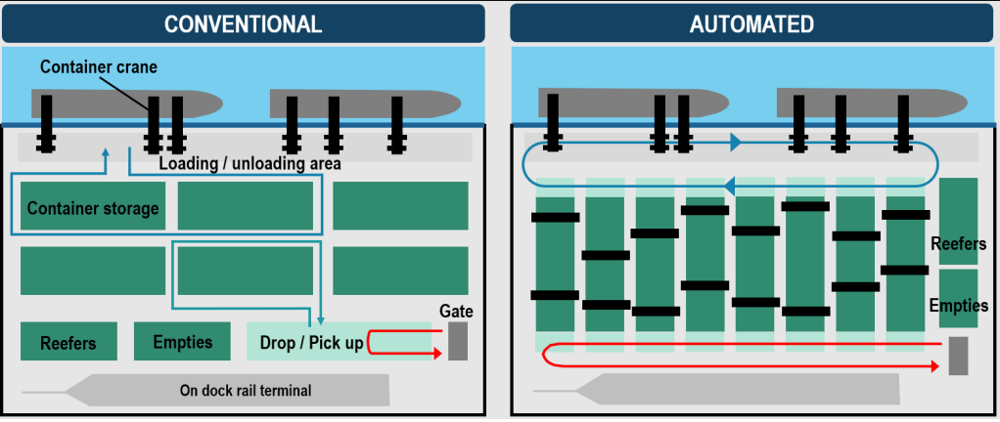 
Between the conventional means of moving containers off of maritime transportation vessels and the circuit-like organization of the automated layout, the automated layout may prove more beneficial in the long run. One of the deciding factors between choosing convention sea-to-land transport methods or automated transport methods could involve the likelihood of consistent results. From the provided visualizations alone, it is apparent that container transport vehicles will spend more time traveling between their destinations in conventional environments. When placed in an automated environment, transport trucks are placed in a circuit where they constantly loop their movements. Doing so allows for consistent speeds and consistent trasporting rates as a result. Conventional transportation may ultimately come down to how the driver performas while doing their task; as in there is the possibility that the truck driver makes errors or generally drives slower than expected, slowing down other operations as a result.  
With an automated storage system, there are two set of revolving vehicle transports: the trucks that transport containers from arriving ships to the automated storage cranes and vice versa, and the trucks that transport containers from the automated storage cranes to the on dock rail terminal for long-distance transportation via railroad. When the two truck roles are kept separate, there is little risk of interrupting or slowing down one another, whereas the conventional layout runs the risk of delays as the two roles often travel through the same areas. 
4. Modify the arrivial rates of the trucks and trains moving containers out of the ship yard. As the rate decreases how does that disrupt the other subsystems in the model?  
Modifying the arrival rates of trucks and trains responsible for transporting storage containers out of the ship yard and into land storage or off the premise would have rippling effects on the rest of the unloading procedure. When the arrival rates for the trucks and trains are reduced, the rest of the system will get backed up and forced to wait until the trasport vehicles arrive to their destination. Ships cannot unload their cargo unless their are vehicles readily available, which in turn delays the next round of ships from entering the docking area. Reducing the arrival rate by mere minutes would eventually add up over an entire day in service, potentially setting the entire port back by an hour or more. Container ships arriving into ports are given an arrival date and time well in advanced before they reach the port so as to not cause any misconceptions or confusion at the port arrival space. Likewise, not only are the land transportation vehicles responsible for unloading ship contents, they are also for ensuring that the land storage areas of a port have enough space to store new containers which requires moving containers off-site via train or other land vehicles. Failing to do so further prevents an efficient from happening.  
On the flip side, increasing the arrival rates for cargo transporting trucks and trains may have diminshing returns for the rest of the system. Regardless of how fast the trucks or trains are, they still have to wait for other components of the port to catch up to them. That means even if the trucks arrive to land storage or a container ship sooner than expected, they still have to wait for the container ship to be pulled into the port or for the overhead cranes to slowly lower down containers. Transport vehicles can move as fast as the rest of the system but if they move slower than the system, then the system lags behind shortly behind.
